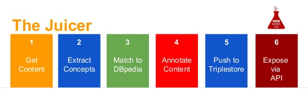
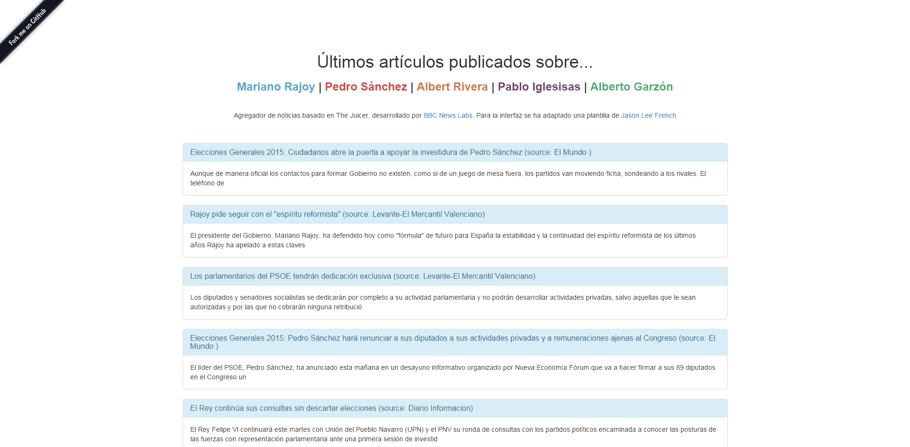
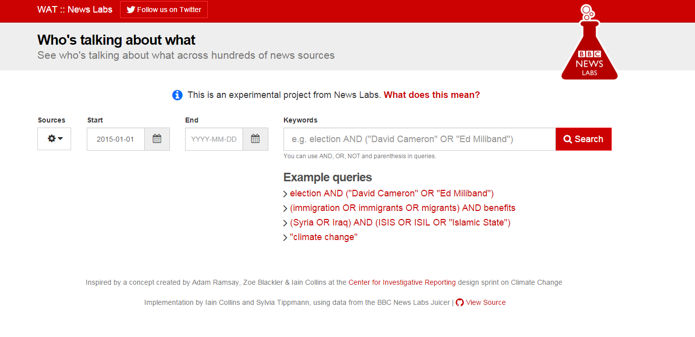

# ¿Qué es una API?

Es posible que hayas utilizado muchas APIs sin saber incluso que lo hacías:

* ¿has pinchado alguna vez en Twitter en la opción de "Compartir"?
* ¿has abierto Facebook o Twitter?

Entonces has utilizado una [API](https://es.wikipedia.org/wiki/Interfaz_de_programación_de_aplicaciones). Más info en [Mozilla] (https://developer.mozilla.org/en-US/docs/Web/Reference/API)

Una API es una herramienta para interactuar con proveedores de Internet. Se pueden utilizar para: Se usan para:

* **recopilar datos** de un proveedor (esto es lo que ocurre cuando lees tuits en tu timeline),
* o **enviar datos** a un servicio (cuando envías un tuit desde una aplicación externa a twitter)

# Seguridad
A menudo los proveedores de contenido ponen restricciones al uso de API por cuestiones de seguridad. Para ello, solicitan una clave para poder acceder al servicio de la API. También suelen existir restricciones para el número de veces que puedes utilizar una API por hora.

# ¿Por qué la API de la BBC?


Para este tutorial vamos a utilizar *BBC linked data API*. Linked data hace referencia a las relaciones entre concreptos presentes en el contenido. Por ejemplo, un artículo que mencione a Barack Obama será considerao por el servicio como un artículo sobre Obama. 
Esta API se llama "the Juicer" y es una de las APIs más sencillas de utilizar. Además tiene una aplicación periodística y puede ser utilizada para investigación. Ha sido desarrollado por BBC News Labs:

* The Juicer extrae noticias de la BBC y de más de 150 medios y los indexa en una base de datos guardando titular, autor, fuente, imágenes...
* Además identifica algunos conceptos de las noticias como pueden ser sus diferentes partes, la fecha en la que fue publicada...
* Esto permite obtener una información concreta y delimitada que puede ser utilizada para crear aplicaciones, obtener info filtrada o una información concreta.

Pero, ¿cómo funciona?

# Hacer peticiones
Para obtener los datos de los que hablamos, tenemos que realizar una petición. Ésta tiene la forma de una url a la que incluimos las variables por las que queremos filtrar y una clave de acceso para conectarnos a la API.

**La clave para este evento es `YB0MY3VMHyllzPqEf5alVj5bUvGpvDVi`. Es temporal, en unos días dejará de funcionar. Sólo puede ser utilizada para tutoriales o investigaciones.**

### Posibles peticiones
A continuación, puedes probar algunas consultas. Para ello, abre las siguientes URLs en tu navegador (acuérdate de incluir la clave API al final de dicha url):
* Todas las fuentes que analiza la API de la BBC - http://juicer.api.bbci.co.uk/sources?api_key=YB0MY3VMHyllzPqEf5alVj5bUvGpvDVi
* Busca sólo contenido de la BBC - http://juicer.api.bbci.co.uk/articles?sources[]=1&api_key=YB0MY3VMHyllzPqEf5alVj5bUvGpvDVi
* Busca la palabra "London" en las noticias de la BBC - http://juicer.api.bbci.co.uk/articles?q=London&sources[]=1&api_key=YB0MY3VMHyllzPqEf5alVj5bUvGpvDVi
* Busca el término "London" en todas las fuentes que integra BBC Juicer, y fíltralo con "David Cameron" - http://juicer.api.bbci.co.uk/articles?q=London&sources[]=1&facets[]=http://dbpedia.org/resource/David_Cameron&api_key=YB0MY3VMHyllzPqEf5alVj5bUvGpvDVi
* Busca el término "London" en todas las fuentes que integra BBC Juicer, y fíltralo con "David Cameron". Muestra los resultados en orden cronológico inverso: 
http://juicer.api.bbci.co.uk/articles?q=London&sources[]=1&facets[]=http://dbpedia.org/resource/David_Cameron&recent_first=true&api_key=YB0MY3VMHyllzPqEf5alVj5bUvGpvDVi

# Obtener una respuesta
Una vez hayas realizado tu petición, el servidor responderá a ella en un formato determinado. El más común de ellos es JSON (*JavaScript Obect Notation*). Este formato es estándar y fácil de tratar en cualquier lenguaje de programación. Es un formato adecuado para expresar relaciones y jerarquías. JSON es el formato que utiliza the Juicer y que utilizaremos en este tutorial.

# Cómo explotar los datos recibidos
Ahora que tenemos una idea de cómo funciona Juicer API es hora de utilizar esos datos. Una de las formas más sencillas para visualizarlos es crear una página web.

En este taller cubriremos los siguientes ejercicios:
* Realizar una petición sobre los artículos más recientes que versen sobre *Madrid*.
* Mostrar los titulares y descripciones de esos titulares en una página web muy básica.

#### Esqueleto HTML5
Abre un editor de textos ( [Sublime Text](https://www.sublimetext.com),[Atom](https://atom.io/) ) y crea un archivo. Llámalo `index.html` y pega el código siguiente en él.

En este esqueleto incluimos las etiquetas base de HTML y enlazamos a jQuery, una librería de Javascript.

```html
    <!DOCTYPE HTML>
    <html>
    <head>
      <meta charset="utf-8" />
      <title>API with jQuery</title>
      <script src="https://cdnjs.cloudflare.com/ajax/libs/jquery/2.1.3/jquery.min.js"></script>
    </head>

    <body>
      <h1>Hello!</h1>
      <button>Get JSON data</button>

      <script>
        // aquí incluiremos nuestro código de Javascript
      </script>

    </body>
    </html>
```

#### Realizar una petición
jQuery es la librería que utilizaremos para obtener los datos estructurados en formato JSON de la API sin tener que parsearlos o diseccionarlos: `$.getJSON()`. El código que tenemos que escribir dentro de la etiqueta <script></script> es el siguiente:

```javascript
    // Introduce la clave API dentro de las dos ''
    var apikey = '';

    // La query o consulta que quieres realizar
    var query = "http://juicer.api.bbci.co.uk/articles?q=London&api_key=" + apikey;

    // Crea el botón y las funciones que te permitirán obtener los datos
    $("button").click(function(){
      $.getJSON(query, function(data){
        console.log(data);
      })
    });
```

Una vez hayas unido el esqueleto HTML con el código javascript en tu editor de textos, guarda el archivo. Nómbralo, por ejemplo, `index.html`. Abre `index.html` en tu navegador y ve las *Herramientas de desarrollo* o *Developer Tools* (`Shift + Ctrl + K` en Firefox, `Shift + Ctrl + J` en Chrome). Otra opción es `botón derecho + Inspeccionar -> Console` Una vez hecho esto, pincha en el botón "Get Json Data".

¡Puedes ver los datos `Object` en la consola!

#### Utiliza los datos para construir una web
Hasta ahora, hemos obtenido los datos en la consola del navegador. ¿Por qué no tomamos ciertos parámetos de el JSON que recibimos y los publicamos en una web? 

Tan sólo tenemos que modificar el código que hemos escrito previamente en Javascript. El código nuevo que utilizaremos es el siguiente (en los comentarios puedes ver paso por paso las instrucciones):

```javascript
    var apikey = ;
    var query = "http://juicer.api.bbci.co.uk/articles?q=London&apikey=" + apikey;

    $("button").click(function(){    
        $.getJSON( query, function( data ) {
          var items = [];       // 1) Tenemos que crear los `items`, which is an empty list. Rellenaremos este hueco con el contenido que queremos obtener de la página web.

          // 2) Then, with `$.each()`, we're writing this loop to peform an operation on each element of `data.hits`.
          $.each( data.hits, function( key, val ) {     

            // 3) We are then *pushing* a piece of HTML to `items`, that we created earlier.
            // This piece of HTML contains a `<li>` element (a list item) which, look at this, has `val.title` for value.
            // `val.title`, I forgot to explain, represents `data.hits.title`, that's just a shortcut we declared.
            items.push( "<li>" + val.title + "</li>" );
          });

          $( "<ul/>", {                 // Then, after the white line, we're grabbing the `<ul>` element in our HTML,
            html: items.join( "" )      // And saying that its HTML should be what's contained in `items`.
          }).appendTo( "body" );        // Finalmente, introducimos esta lista de elementos en nuestro *body* de HTML.
        });
    });
```

Una vez hayas actualizado tu archivo `index.html`guárdalo. Ábrelo de nuevo en tu navegador y pulsa el botón GetJson. Espera unos segundos... ¡ahí está!

No ha cambiado mucho con respecto al código que hemos abierto en la consola. Lo único que esta vez vemos los artículos en nuestro navegador.

[Aquí] (https://github.com/adrianblanco/journocodersmadrid_APIs/blob/master/ejemplo_api.html) puedes acceder a un ejemplo completado.

# Para saber más... algunos ejercicios

¿Quieres practicar? Aquí tienes algunas propuestas de ejercicios. Las soluciones están al final del documento, pero prueba primero por ti mismo, ¡es muy sencillo!

## Crea un titular enlazado a una url

Wouldn't it be useful to be able to click through to each article? The URLs are returned in the API response - can you get those into the HTML?

## Cambia el término de búsqueda
¿Qué quieres buscar? Prueba a cambiar "Madrid" por algo más interesante.

## Busca artículos publicados antes de 2014
Hasta ahora hemos probado a hacer búsquedas sobre Madrid (`q=Madrid`) con la clave mencionada antes (`apikey={apikey}`). Pero podemos utilizar otras variables para filtrar los resultados. Consulta [la documentación de la API](http://docs.bbcnewslabs.co.uk/Juicer-2.html) para encontrar otros parámetos o variables.

# De aquí en adelante...
Este es un tutorial de iniciaición con la API de la BBC, pero ¿qué puedes crear a partir de ahora?
Un ejemplo es este [agregador de noticias](https://chrome.google.com/webstore/detail/postman-rest-client/fdmmgilgnpjigdojojpjoooidkmcomcm?hl=en) creado para rastrear las intervenciones de los principales candidatos durante la campaña electoral del 20-D. 




Nos fue útil para rastrear todas las promesas que incluimos en [El Prometómetro](http://www.elconfidencial.com/elecciones-generales/2015-12-01/prometometro-promesas-elecciones-generales-20d_1107039/). Puedes leer más info en el blog de [BBC News Labs](http://bbcnewslabs.co.uk/2015/12/15/eclabs-and-juicer/)

Échale imaginación. Ya sabes, para este tipo de proyectos lo mejor es echarle un vistazo a [la documentación](http://docs.bbcnewslabs.co.uk/Juicer-2.html)!

# Solución a los ejercicios anteriores

## Crea un titular enlazado a una url

Parámetros que utilizaremos: `title` y `url`:

```js
items.push( "<li><a href='" + val.url + "'>" + val.title + "</a></li>" );
```

## Cambia el término de búsqueda
Se puede cambiar el término de búsqueda de Madrid por otro de manera muy fácil. Si, por ejemplo, utilizamos David Cameron necesitamos incluir un espacio. Para ello utilizaremos la expresión `%20`.

```js
var query = "http://juicer.api.bbci.co.uk/articles?q=David%20Cameron&apikey=" + apikey;
```

## Busca artículos publicados antes de 2014

Utilizar el parámetro `published_before` en la URL como se menciona en la [API documentation](http://docs.bbcnewslabs.co.uk/Juicer-2.html):

```js
var query = "http://juicer.api.bbci.co.uk/articles?q=London&published_before=2014-01-01T00:00:00.000Z&apikey=" + apikey;
```


Otra opción mucho más sencilla, pero limitada, es ésta [interfaz](http://wat.bbcnewslabs.co.uk/) que ha creado BBC News Labs para acceder a la base de datos de The Juicer.



